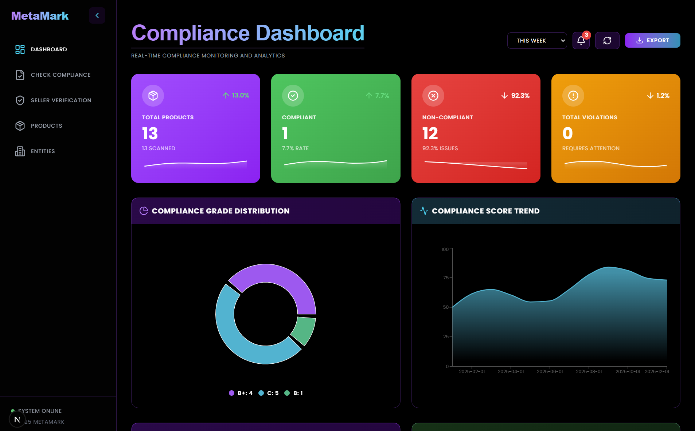
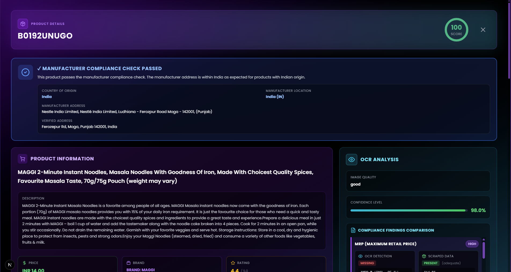
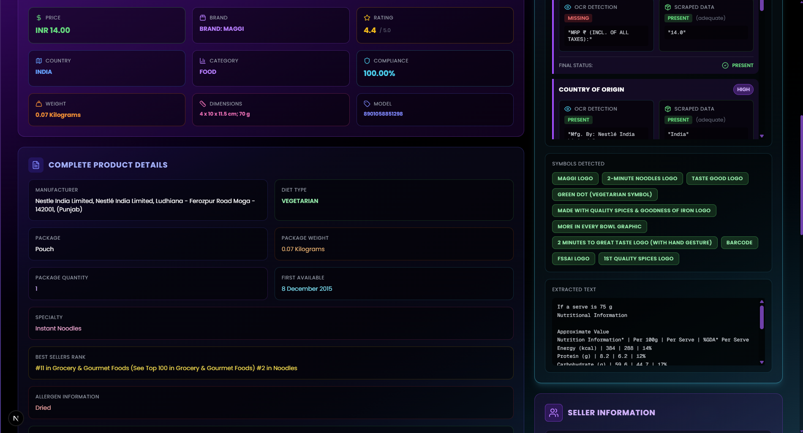
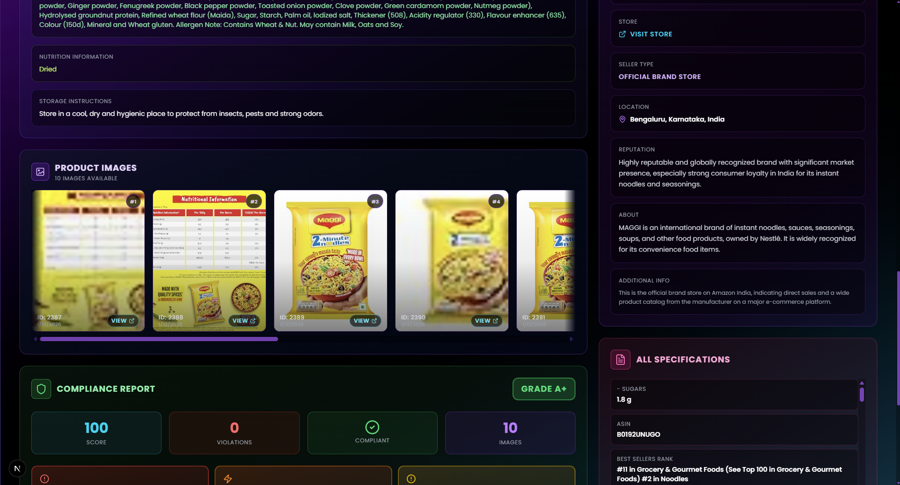

# LegalGuard

AI-Driven Automated Legal Metrology Compliance Checker

Team De-bug
Smart India Hackathon 2026

---

## Problem Statement

**SIH26034** is an official software problem statement for the Smart India Hackathon (SIH) 2026. It is hosted by the Ministry of Consumer Affairs, Food & Public Distribution under the Miscellaneous / Agriculture, FoodTech & Rural Development theme.

- **Title:** Software System to check compliance of Packaged Commodities under Legal Metrology (Packaged Commodities) Rules, 2011 by scanning products, images and labels.
- **Category:** Software Edition
- **Core Objective:** Build an AI-assisted compliance-checking platform that automatically inspects and verifies product packages and labels against the mandatory statutory declarations required under Indian Legal Metrology laws.
- **Expected Solution:** A Computer Vision / OCR engine to extract textual metadata from product label images or real-time camera feeds, a Compliance Validation Model that verifies the mandatory declarations under the 2011 Rules (manufacturer name and address, generic name of the commodity, net quantity, month and year of manufacture, unit sale price, consumer care details, etc.), and an Automated Workflow Dashboard for inspectors to identify compliance anomalies, generate inspection reports and track flagging histories.
- **Verification:** Refer to the Smart India Hackathon portal for the official problem statement catalogue and submission deadlines.

---

## Project Description

LegalGuard is an AI-driven compliance verification system that automatically validates Legal Metrology declarations on packaged commodities and e-commerce listings. The platform combines Gemini multimodal vision for label OCR, LLM reasoning for rule interpretation, a deterministic rule-based compliance engine, and automated scoring and reporting to detect missing declarations, incorrect declarations, and regulatory violations before products reach consumers.

The system is delivered as three connected components:

1. **A Flask backend** (`legal_metrology_backend/legal_metrology/server.py`) that handles authentication, scraping, AI analysis, compliance scoring, persistence in MySQL, analytics and rewards.
2. **A Next.js web dashboard** (`frontend/`) where customers, sellers and inspectors run compliance checks, view reports, browse analytics and manage rewards.
3. **A Chrome extension** (`extension/`) that overlays compliance checks directly on Amazon and Flipkart product pages.

The pipeline works end to end: a product URL or label image goes in; a graded, explainable, audit-ready compliance report comes out, and every analysis is stored so that inspectors can track violation histories over time.

---

## High-Level Architecture

```
E-commerce Listing / Label Image / Camera Capture
        |
        v
AI Category Router (Gemini) + Hardened Fetcher
        |
        v
Extraction (BeautifulSoup scrapers OR Gemini Multimodal OCR)
        |
        v
Compliance Validation Engine (LLM reasoning + 2011-Rules checklist + offline fallback)
        |
        v
Weighted Scoring, Grade, Violation Summary, Assessment
        |
        v
MySQL Persistence (products, reports, activity, tokens)
        |
        v
Dashboard, Inspection Reports, Heatmaps, Chatbot, Rewards
```

---

## Features and How Each One Works

### 1. AI-Powered Category Routing

When a product URL is submitted, the backend asks Gemini to classify the product into one of the supported categories (Books, Electronics, Food, Skincare, or a generic fallback). The chosen category determines two things: which category-specific scraper parses the page, and which Legal Metrology rule set is used during compliance analysis (for example, food products must display a 14-digit FSSAI license number, while electronics must display a BIS/ISI mark). If the Gemini API key is missing or the quota is exhausted, the router falls back to deterministic keyword heuristics so submission never fails.

### 2. Hardened Web Scraping

All scrapers share a single fetcher module (`amazon_scraper/fetcher.py`) that keeps scraping reliable against Amazon's anti-bot defenses. It rotates among modern browser user agents with matching Client-Hint headers, advertises Brotli compression only when a decoder is installed, primes cookies on the Amazon homepage before requesting product pages, detects CAPTCHA and bot-wall responses, retries with exponential backoff and jitter, and optionally falls back to a headless browser (enabled with `SCRAPER_BROWSER_FALLBACK=1`). A rotating proxy can be attached through `SCRAPER_PROXY` for heavy usage. Each scraper then extracts structured fields (title, price, seller information, features, specifications, image URLs) using BeautifulSoup and lxml.

### 3. Gemini Multimodal Label OCR

For label images, either scraped product photos or seller-uploaded captures, the backend sends the images to Gemini 2.5 Flash as a multimodal model. The model performs OCR and visual understanding in one pass: it reads printed text, recognizes statutory marks and symbols, and returns structured findings for every mandatory declaration it can see on the label (net quantity, MRP, manufacturer address, manufacture date, FSSAI or BIS marks, veg/non-veg indicator, and so on). Uploaded images are validated before reaching the AI layer (extension, magic bytes and size), and the total request size is capped at 64 MB.

### 4. Compliance Validation Engine (the core of SIH26034)

This is the Compliance Validation Model required by the problem statement. It verifies mandatory declarations under the Legal Metrology (Packaged Commodities) Rules, 2011 using two layers that cross-check each other:

- **Rule layer:** A structured rule book (`REGULATORY_RULES` in `compliance.py` / `comply.py`) defines, per product category, which declarations are critical, major or minor, the negative weight of each missing declaration, and the keywords and regex patterns used to locate the declaration in the extracted text (for example, the 14-digit FSSAI regex, net-quantity units such as kg, g, ml and L, expiry and best-before phrasing, MRP patterns). The full listing JSON is flattened and searched everywhere so a declaration found anywhere in the title, bullets, specifications or seller information counts.
- **LLM layer:** Gemini receives the extracted product data and/or OCR findings together with the category rule checklist and returns a structured per-requirement verdict (requirement, status, where it was found, extracted value, adequacy, notes). This layer catches semantic gaps that keywords miss, such as an address that exists but is incomplete.

When the two layers disagree or one fails, the engine resolves conservatively. When the AI layer is down entirely (rate limit, outage) the offline deterministic extractor (`offline_analysis.py`) still produces findings, and if no layer produced any findings at all the report is marked `analysis_mode: indeterminate` with score `None` and grade `N/A`, rather than fabricating a failing grade.

### 5. Confidence-Weighted Scoring, Grading and Assessment

The compliance engine starts from a perfect score of 100 and subtracts the weight of every missing or inadequate declaration (a missing FSSAI number costs 20 points, a missing expiry date 18, and so on, scaled by severity). The result is a numeric compliance score and a letter grade (A+ through F) plus a violation summary broken down into critical, major and minor counts. A real, per-product assessment paragraph is then generated (`assessment.py`): Gemini writes a concise verdict from a sanitized fact sheet of the report, and if Gemini is unavailable a deterministic assessment is composed directly from the actual score, grade and violations, so two products with different results always get different text. Reports are persisted into the `Products` table (analysis results, remarks, last analysed timestamp) so grades survive restarts and can be filtered later.

### 6. Pre-Upload Validation for Sellers

Sellers can validate a listing before it goes live. The Seller Verification page accepts a product description, actual weight and dimensions, and label images either uploaded from disk or captured live from a webcam (the camera feed uses `getUserMedia` with rear-facing preference; frames are captured to a canvas and converted to image files). The backend runs the same OCR-plus-rules compliance engine over the images and text and returns a readiness report with violations and fix suggestions, which reduces delisting risk and manual review overhead. A text-only variant of this check is also exposed for quick checks without images.

### 7. Dashboard and Inspection Reports

The web dashboard aggregates all of a user's analyzed products into charts (grade distribution, violation trends over time) built with Recharts, and lists every product with its stored grade and score. Each product has a detail view with the full compliance report: score, grade, per-declaration status, violations with severity, the AI assessment, and the product images that were analyzed. Because every report is persisted with a timestamp, the dashboard doubles as the flagging-history tracker required for inspector workflows. Reports can also be run in batch over multiple products at once.

### 8. Geospatial Violation Heatmaps

Every scrape that a customer performs on a product is logged in the `selleractivity` table with the seller, customer, action and location (geolocation from the client IP via ipapi.co; seller addresses can also be geocoded). The heatmap endpoints aggregate this activity into latitude/longitude points that the frontend renders as an interactive Leaflet map with a heat layer (`leaflet.heat`), showing where compliance interest and violations cluster, both per-seller and globally. A city-level fallback table is used when exact coordinates are unavailable.

### 9. Grounded Compliance Chatbot

The chatbot answers two kinds of questions. First, an intent classifier (Gemini, with keyword fallback) decides whether the user is asking about their own data or about regulations in general. Personal-data questions are answered by a LangChain SQL agent that queries the MySQL database directly (the user's products, scores and statistics). General compliance questions are answered through a retrieval-augmented generation path: the rule book is flattened into stable rule IDs (`LM-<category>-<n>`), a lexical retriever selects the most relevant rules, and the prompt forbids the model from citing any rule outside the retrieved context. The model's answer is then post-checked so every citation it makes refers to a real retrieved rule ID, which is the guard against hallucinated rule references. Raw API error text is never shown to users.

### 10. Chrome Extension

The Manifest V3 extension overlays LegalGuard on Amazon and Flipkart product pages. A content script detects product pages by URL pattern, and the popup handles login, backend health status, enable/disable toggling and an activity log. When a product page is detected, the extension calls the backend scrape-and-analyze API and renders the compliance verdict as an overlay on the page itself, so a shopper or inspector can see a product's compliance grade without leaving the marketplace.

### 11. Meta-Token Reward System

Users earn Meta-Tokens (MT) as a reward for verified actions, currently a completed, genuine (non-demo) compliance analysis; the amount is fixed server-side and cannot be minted by the client. Tokens accumulate in the user's account and can be redeemed in fixed slabs for gift cards listed in the rewards catalogue. The Rewards page shows the current balance, available gifts, and the full redemption history with gift codes and PINs. Self-service token minting is deliberately disabled.

### 12. Resilience and Security

The system is built to fail gracefully and safely:

- **Demo mode:** Without a `GOOGLE_API_KEY`, every AI feature falls back to a clearly-tagged demo report instead of crashing.
- **AI rate-limit guard** (`ai_guard.py`): the first Gemini 429 mutes AI calls for a cooldown window so requests fail fast to the offline engine instead of hanging in SDK backoff loops; friendly messages replace raw quota errors.
- **Offline analysis fallback** (`offline_analysis.py`): deterministic keyword/regex extraction when the AI is unavailable; indeterminate results are graded N/A rather than a fake zero.
- **Authentication:** bcrypt password hashing, session-based login with a 24-hour lifetime, role-based access (customer and seller), and ownership checks on image and data access.
- **Rate limiting:** Flask-Limiter caps expensive endpoints (auth, analysis, chat, redemption) per IP address.
- **Input validation:** 64 MB request ceiling, image type and magic-byte validation, sanitized global error handler that never leaks tracebacks, and CORS restricted to the frontend origin.

---

## Tech Stack

| Layer | Technologies |
| --- | --- |
| Frontend | Next.js (App Router), React, Tailwind CSS, Recharts, Leaflet + leaflet.heat, Framer Motion |
| Backend | Python, Flask, Flask-Limiter, Flask-CORS |
| AI | Google Gemini 2.5 Flash (multimodal OCR + LLM reasoning), LangChain (SQL agent, Google GenAI integration) |
| Scraping | requests, BeautifulSoup, lxml, optional Selenium headless fallback |
| Database | MySQL 8 (products, images as BLOBs, reports, activity, gifts) |
| Extension | Chrome Manifest V3 (service worker, content scripts, popup) |
| Infrastructure | Docker Compose (MySQL), PowerShell / bash setup scripts |

---

## Repository Layout

```
metamark/
├── README.md                            # this file
├── docker-compose.yml                   # one-command MySQL 8 stack (port 3307)
├── setup.ps1 / setup.sh                 # one-command setup scripts
├── legal_metrology_backend/
│   └── legal_metrology/
│       ├── server.py                    # Flask backend entry point
│       ├── compliance.py                # compliance analysis + grounded chatbot
│       ├── compliance_copy.py           # text-based analysis used by scrape/validate
│       ├── comply.py                    # image-based seller upload analysis
│       ├── grounding.py                 # RAG rule retrieval + citation validation
│       ├── assessment.py                # deterministic/AI report assessments
│       ├── offline_analysis.py          # offline fallback extractor
│       ├── ai_guard.py                 # Gemini rate-limit cooldown guard
│       ├── amazon_scraper/              # AI-routed category scrapers + shared fetcher
│       ├── database_schema.sql          # canonical MySQL schema
│       ├── seed_demo_data.py            # idempotent demo data seeder
│       └── requirements.txt
├── frontend/                            # Next.js dashboard
│   ├── app/                             # auth, dashboard, products, check-compliance,
│   │                                    # seller-verification, chatbot, entities, rewards
│   └── components/ViolationHeatmap.tsx  # Leaflet heat layer
├── extension/                           # Chrome MV3 compliance overlay
└── docs/                                # user guide + screenshots
```

---

## How the End-to-End Flow Works

1. **Input.** A user submits an Amazon product URL from the dashboard or the extension, or a seller uploads/captures label images on the Seller Verification page.
2. **Fetch and extract.** The AI router classifies the product; the shared fetcher retrieves the page (or the uploaded images are validated) and structured data is extracted.
3. **Analyze.** The compliance engine runs the rule layer and the LLM layer over the extracted text and OCR findings, checking every mandatory declaration for the product's category.
4. **Score.** Weights are applied, producing a score, grade, violation summary, per-declaration statuses and an assessment paragraph.
5. **Persist.** The product, images, compliance report, and activity record are written to MySQL with timestamps.
6. **Consume.** The dashboard, product detail pages, heatmaps, chatbot and rewards reflect the new state; inspectors can track violation histories, and users earn MT tokens for verified checks.

---

## Getting Started

### Prerequisites

- Python 3.8+ and a MySQL 8 instance
- Node.js for the frontend
- A Google Cloud account with the Generative AI API enabled (for full AI features; without a key the system runs in clearly-tagged demo mode)
- Docker (optional, for the bundled MySQL stack)

### One-Command Setup (Windows)

```powershell
powershell -ExecutionPolicy Bypass -File setup.ps1
```

The script creates `.env` from the template, builds the Python virtualenv and installs dependencies, starts MySQL 8 via Docker Compose on port 3307 (loading the canonical schema automatically), and installs frontend dependencies. macOS/Linux users run `./setup.sh`.

### Manual Setup

1. **Backend:** from `legal_metrology_backend/legal_metrology`, copy `.env.example` to `.env` and fill in your MySQL credentials and `GOOGLE_API_KEY`, then:

   ```bash
   pip install -r requirements.txt
   python server.py
   ```

   The API starts at `http://localhost:5000`.

2. **Database:** run `database_schema.sql` against your MySQL instance (or let the Docker Compose stack load it on first boot). Increase `max_allowed_packet` to at least 64 MB for image BLOBs.

3. **Frontend:** from `frontend/`:

   ```bash
   npm install
   npm run dev
   ```

   The dashboard starts at `http://localhost:3000`.

4. **Demo data (recommended for demos):** from the backend directory, run `seed_demo_data.py`; it is idempotent and creates a demo user (`demo` / `Dem0@LegalGuard!`) plus three sample products with persisted compliance reports.

5. **Extension:** load the `extension/` folder as an unpacked extension in Chrome, ensure the backend is running, and log in from the popup.

---

## Screenshots

Compliance Dashboard:



AI Compliance Analysis:







---

## Demo

Live demo: https://youtu.be/xZJdHqtpcVk

---

## Team

Team De-bug
Smart India Hackathon 2026


